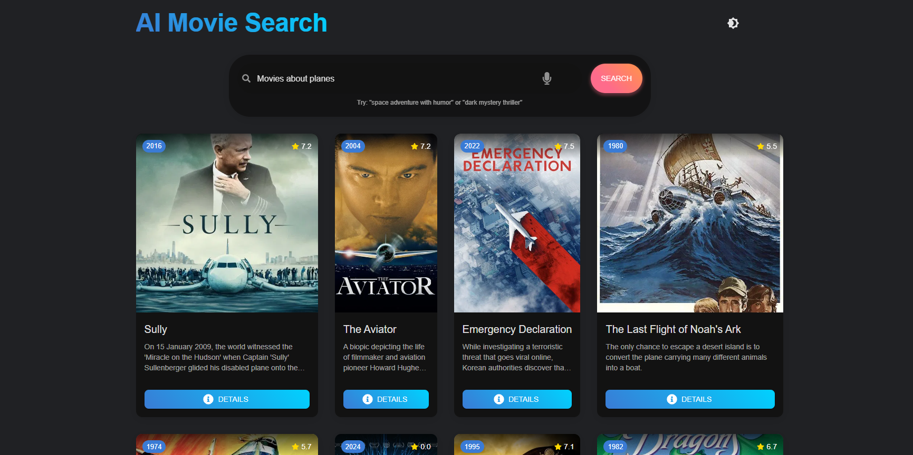

# AI-Movie-Search

An AI-powered movie search app that understands natural language queries like "movies about space adventures" or "funny films with planes".

[](https://opensource.org/licenses/MIT)
[](https://reactjs.org/)
[](https://huggingface.co/)



## Features

- **Natural Language Understanding**: Describe movies in your own words
- **Smart Recommendations**: Gets better results than keyword searches
- **Popular Movies Focus**: Prioritizes well-known, high-quality films
- **Responsive Design**: Works on all devices
- **Space Movie Specialization**: Excellent for sci-fi/space queries

## How It Works

1. Type your movie request (e.g., "scary movies with ghosts")
2. The app uses Hugging Face AI to understand your query
3. Searches The Movie Database (TMDB) with optimized parameters
4. Displays the best matching movies with posters and details

## Technologies Used

- React.js
- Material-UI
- Hugging Face Inference API
- TMDB API
- Axios

## Setup Instructions

1. Clone the repository:
   ```bash
   git clone https://github.com/yourusername/MovieSense.git
   cd MovieSense

2. Install dependencies:
    ```bash
    npm install

3. Create a .env file:
    ```bash
    REACT_APP_HF_API_KEY=your_huggingface_token
    REACT_APP_TMDB_KEY=your_tmdb_api_key

4. Run the development server:
    ```bash
    npm start


## Future Imporvements

- Add user accounts to save favorites.
- Include streaming availability information.
- Add trailer previews.
- Implement "similar to this movie" feature.